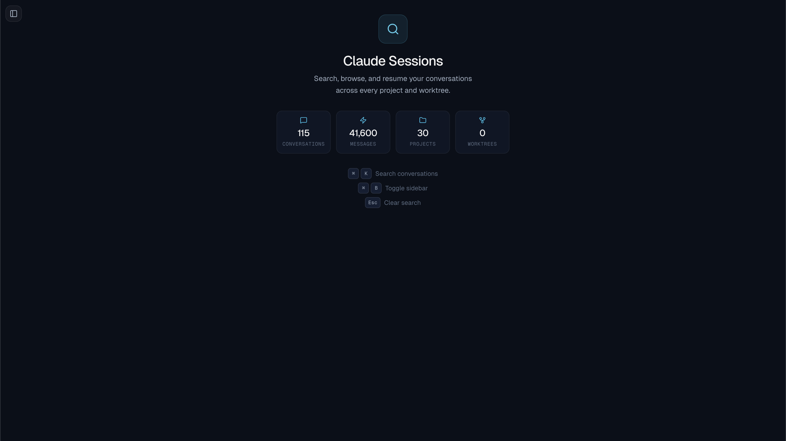

<p align="center">
  <h1 align="center">ccode-sessions</h1>
  <p align="center">
    A local web UI for searching, browsing, and resuming your <code>claude-code</code> conversations across every project and worktree.
  </p>
</p>

<p align="center">
  <a href="https://github.com/0xadvait/ccode-sessions/blob/main/LICENSE">
    
  </a>
  <a href="https://twitter.com/advait_jayant">
    
  </a>
  <a href="https://github.com/0xadvait/ccode-sessions/stargazers">
    
  </a>
</p>

<p align="center">
  
</p>

<p align="center">
  <em>115 conversations, 41k messages, 30 projects — all searchable from a single interface.</em>
</p>

---

## The Problem

If you use `claude-code` heavily, you accumulate hundreds of conversations scattered across dozens of project directories in `~/.claude/projects/`. Finding that one session where you debugged a tricky issue three weeks ago? Good luck.

**ccode-sessions** gives you a **ChatGPT-style sidebar** for your entire conversation history — with fuzzy search that lets you **describe what you were working on** instead of remembering exact keywords.

## How It Works

```
~/.claude/projects/*/     →  Express indexer  →  In-memory Fuse.js index
~/.claude/history.jsonl   →                      ↓
                             chokidar watcher  →  SSE push  →  React sidebar auto-updates
```

1. The backend scans every `~/.claude/projects/` directory to discover conversation JSONL files
2. It parses metadata (first prompt, timestamps, message count, git branch) from each
3. Builds a fuzzy search index over all conversations using [Fuse.js](https://www.fusejs.io/)
4. Watches the directory for changes — new sessions appear in the sidebar within seconds
5. The frontend renders conversations with full Markdown, syntax-highlighted code blocks, and collapsible thinking/tool-use blocks

## Quick Start

```bash
git clone https://github.com/0xadvait/ccode-sessions.git
cd ccode-sessions
npm install
npm run dev
```

Open **http://localhost:5173**. That's it.

## Features

| Feature | Description |
|---------|-------------|
| **Global browser** | Every conversation across all projects, grouped by date or project |
| **Spotlight search** | `Cmd/Ctrl+K` opens a spotlight modal — describe what you were working on |
| **Fuzzy search** | Fuse.js-powered — no exact keywords needed |
| **Real-time updates** | New sessions appear instantly via file watching + SSE |
| **Resume in one click** | Opens a terminal with `claude --resume <session-id>` |
| **Conversation viewer** | Markdown rendering, syntax highlighting, collapsible thinking/tool blocks |
| **Keyboard shortcuts** | `Cmd/Ctrl+K` search, `Cmd/Ctrl+B` toggle sidebar, `Esc` clear |

## Platform Support

| Platform | Browse & Search | Resume |
|----------|-----------------|--------|
| macOS | Yes | Opens Terminal.app |
| Linux | Yes | Uses x-terminal-emulator / xterm / gnome-terminal |
| Windows | Yes | Opens cmd.exe |

## Security

- Server binds to `127.0.0.1` only — not exposed to the network
- CORS restricted to localhost origins
- Session IDs validated as UUIDs before any filesystem or shell interaction
- All data stays on your machine — nothing is sent to any external service

## API

| Endpoint | Description |
|----------|-------------|
| `GET /api/sessions` | List all indexed sessions |
| `GET /api/sessions/:id/messages?cursor=0` | Paginated conversation messages (50 per page) |
| `GET /api/search?q=...` | Fuzzy search across conversations |
| `POST /api/sessions/:id/resume` | Open terminal and resume session |
| `GET /api/events` | SSE stream for real-time updates |

## Project Structure

```
server/
  index.ts          # Express server, SSE, chokidar file watcher
  indexer.ts         # Scans ~/.claude/projects/, builds session index
  parser.ts          # Streams JSONL conversation files with cursor pagination
  search.ts          # Fuse.js fuzzy search index
  claude-paths.ts    # Path resolution, project name decoding
  types.ts           # Shared TypeScript types

src/
  components/
    layout/          # AppShell with sidebar + main area
    sidebar/         # Spotlight search, session list, session cards
    conversation/    # Message bubbles, code blocks, thinking/tool blocks, welcome view
  hooks/             # useSessionList (SSE), useConversation (pagination), useSearch (debounce)
  store/             # Zustand state management
  api/               # Fetch client + SSE connection
```

## Built With

- [React 19](https://react.dev) + [Vite](https://vite.dev) — Frontend
- [Express 5](https://expressjs.com) — Backend API
- [Tailwind CSS 4](https://tailwindcss.com) — Styling
- [Fuse.js](https://www.fusejs.io) — Fuzzy search
- [Motion](https://motion.dev) — Animations
- [chokidar](https://github.com/paulmillr/chokidar) — File watching for real-time updates
- [Zustand](https://zustand.docs.pmnd.rs) — State management
- [Lucide](https://lucide.dev) — Icons

## Requirements

- Node.js 18+
- A CLI tool that stores conversations in `~/.claude/` (e.g. [claude-code](https://docs.anthropic.com/en/docs/claude-code))

## License

[MIT](LICENSE) — Copyright (c) 2026 Advait Jayant
